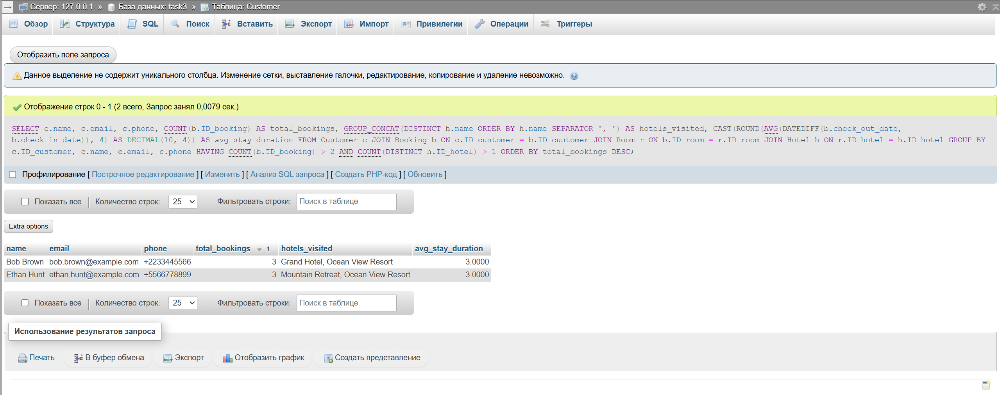

Определить, какие клиенты сделали более двух бронирований в разных отелях, и вывести информацию о каждом таком клиенте,
включая его имя, электронную почту, телефон, общее количество бронирований, а также список отелей, в которых они
бронировали номера (объединенные в одно поле через запятую). Также подсчитать среднюю длительность их пребывания (в
днях) по всем бронированиям. Отсортировать результаты по количеству бронирований в порядке убывания.

## Ожидаемый вывод для тестовых данных:

| name       | email                  | phone       | total_bookings | hotels_visited                      | avg_stay_duration |
|------------|------------------------|-------------|----------------|-------------------------------------|-------------------|
| Bob Brown  | bob.brown@example.com  | +2233445566 | 3              | Grand Hotel, Ocean View Resort      | 3.0000            |
| Ethan Hunt | ethan.hunt@example.com | +5566778899 | 3              | Mountain Retreat, Ocean View Resort | 3.0000            |

## Решение:

```sql
SELECT c.name,
       c.email,
       c.phone,
       COUNT(b.ID_booking)                                                                AS total_bookings,
       GROUP_CONCAT(DISTINCT h.name ORDER BY h.name SEPARATOR ', ')                       AS hotels_visited,
       CAST(ROUND(AVG(DATEDIFF(b.check_out_date, b.check_in_date)), 4) AS DECIMAL(10, 4)) AS avg_stay_duration
FROM Customer c
         JOIN Booking b
              ON c.ID_customer = b.ID_customer
         JOIN Room r ON b.ID_room = r.ID_room
         JOIN Hotel h ON r.ID_hotel = h.ID_hotel
GROUP BY c.ID_customer, c.name, c.email, c.phone
HAVING COUNT(b.ID_booking)
    > 2
   AND COUNT(DISTINCT h.ID_hotel)
    > 1
ORDER BY total_bookings DESC;
```




