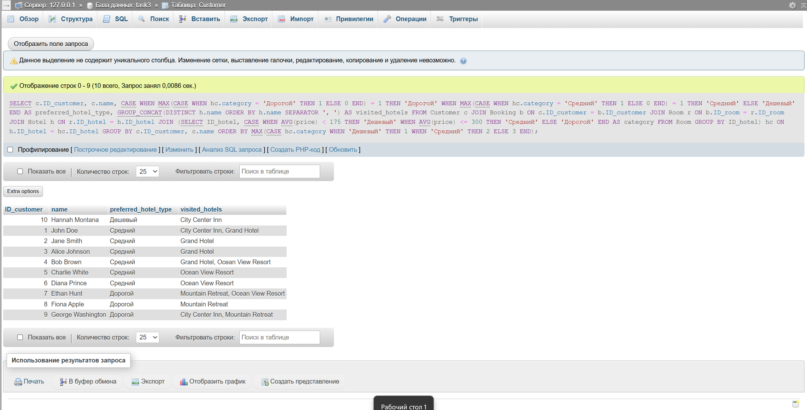

## Условие

Вам необходимо провести анализ данных о бронированиях в отелях и определить предпочтения клиентов по типу отелей. Для этого выполните следующие шаги:

1. Категоризация отелей. 

   Определите категорию каждого отеля на основе средней стоимости номера:

   - «Дешевый»: средняя стоимость менее 175 долларов.
   - «Средний»: средняя стоимость от 175 до 300 долларов.
   - «Дорогой»: средняя стоимость более 300 долларов.

2. Анализ предпочтений клиентов. 
   
   Для каждого клиента определите предпочитаемый тип отеля на основании условия ниже:

   - Если у клиента есть хотя бы один «дорогой» отель, присвойте ему категорию «дорогой».
   - Если у клиента нет «дорогих» отелей, но есть хотя бы один «средний», присвойте ему категорию «средний».
   - Если у клиента нет «дорогих» и «средних» отелей, но есть «дешевые», присвойте ему категорию предпочитаемых отелей «дешевый».

3. Вывод информации.

   Выведите для каждого клиента следующую информацию:

   - ID_customer: уникальный идентификатор клиента.
   - name: имя клиента.
   - preferred_hotel_type: предпочитаемый тип отеля.
   - visited_hotels: список уникальных отелей, которые посетил клиент.

4. Сортировка результатов.

   Отсортируйте клиентов так, чтобы сначала шли клиенты с «дешевыми» отелями, затем со «средними» и в конце — с «дорогими».

## Ожидаемый вывод для тестовых данных

| ID_customer | name              | preferred_hotel_type | visited_hotels                                    |
|-------------|-------------------|----------------------|---------------------------------------------------|
| 10          | Hannah Montana    | Дешевый              | City Center Inn                                   |
| 1           | John Doe          | Средний              | City Center Inn, Grand Hotel                      |
| 2           | Jane Smith        | Средний              | Grand Hotel                                       |
| 3           | Alice Johnson     | Средний              | Grand Hotel                                       |
| 4           | Bob Brown         | Средний              | Grand Hotel, Ocean View Resort                    |
| 5           | Charlie White     | Средний              | Ocean View Resort                                 |
| 6           | Diana Prince      | Средний              | Ocean View Resort                                 |
| 7           | Ethan Hunt        | Дорогой              | Mountain Retreat, Ocean View Resort               |
| 8           | Fiona Apple       | Дорогой              | Mountain Retreat                                  |
| 9           | George Washington | Дорогой              | City Center Inn, Mountain Retreat                 |

## Решение:

```sql
SELECT c.ID_customer,
       c.name,
       CASE
          WHEN MAX(CASE WHEN hc.category = 'Дорогой' THEN 1 ELSE 0 END) = 1 THEN 'Дорогой'
          WHEN MAX(CASE WHEN hc.category = 'Средний' THEN 1 ELSE 0 END) = 1 THEN 'Средний'
          ELSE 'Дешевый'
          END AS preferred_hotel_type,
       GROUP_CONCAT(DISTINCT h.name ORDER BY h.name SEPARATOR ', ') AS visited_hotels
FROM Customer c
        JOIN Booking b ON c.ID_customer = b.ID_customer
        JOIN Room r ON b.ID_room = r.ID_room
        JOIN Hotel h ON r.ID_hotel = h.ID_hotel
        JOIN (SELECT ID_hotel,
                     CASE WHEN AVG(price) < 175 THEN 'Дешевый'
                          WHEN AVG(price) <= 300 THEN 'Средний'
                          ELSE 'Дорогой' END AS category
              FROM Room
              GROUP BY ID_hotel) hc ON h.ID_hotel = hc.ID_hotel
GROUP BY c.ID_customer, c.name
ORDER BY MAX(CASE hc.category WHEN 'Дешевый' THEN 1 WHEN 'Средний' THEN 2 ELSE 3 END);
```


