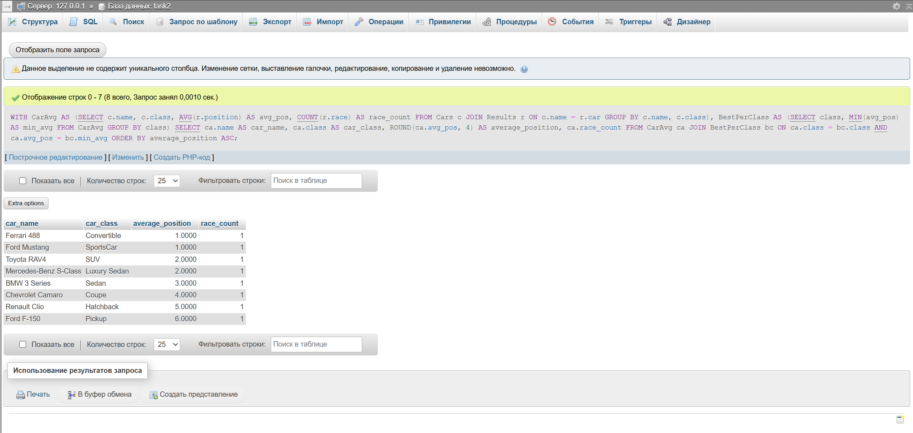

Определить, какие автомобили из каждого класса имеют наименьшую среднюю позицию в гонках, и вывести информацию о каждом
таком автомобиле для данного класса, включая его класс, среднюю позицию и количество гонок, в которых он участвовал.
Также отсортировать результаты по средней позиции.

## Ожидаемый вывод для тестовых данных:

| car_name              | car_class    | average_position | race_count |
|-----------------------|--------------|------------------|------------|
| Ferrari 488           | Convertible  | 1.0000           | 1          |
| Ford Mustang          | SportsCar    | 1.0000           | 1          |
| Toyota RAV4           | SUV          | 2.0000           | 1          |
| Mercedes-Benz S-Class | Luxury Sedan | 2.0000           | 1          |
| BMW 3 Series          | Sedan        | 3.0000           | 1          |
| Chevrolet Camaro      | Coupe        | 4.0000           | 1          |
| Renault Clio          | Hatchback    | 5.0000           | 1          |
| Ford F-150            | Pickup       | 6.0000           | 1          |

## Решение:

```sql
WITH CarAvg AS (SELECT c.name,
                       c.class,
                       AVG(r.position) AS avg_pos,
                       COUNT(r.race)   AS race_count
                FROM Cars c
                         JOIN Results r ON c.name = r.car
                GROUP BY c.name, c.class),
     BestPerClass AS (SELECT class,
                             MIN(avg_pos) AS min_avg
                      FROM CarAvg
                      GROUP BY class)
SELECT ca.name              AS car_name,
       ca.class             AS car_class,
       ROUND(ca.avg_pos, 4) AS average_position,
       ca.race_count
FROM CarAvg ca
         JOIN BestPerClass bc ON ca.class = bc.class AND ca.avg_pos = bc.min_avg
ORDER BY average_position ASC;
```



