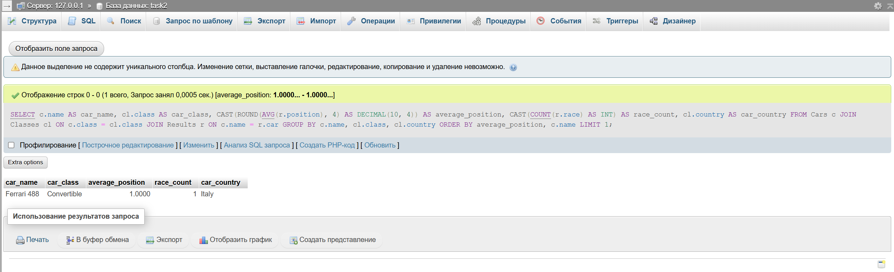

## Условие

Определить автомобиль, который имеет наименьшую среднюю позицию в гонках среди всех автомобилей, и вывести информацию об
этом автомобиле, включая его класс, среднюю позицию, количество гонок, в которых он участвовал, и страну производства
класса автомобиля. Если несколько автомобилей имеют одинаковую наименьшую среднюю позицию, выбрать один из них по
алфавиту (по имени автомобиля).

## Ожидаемый вывод для тестовых данных

| car_name    | car_class   | average_position | race_count | car_country |
|-------------|-------------|------------------|------------|-------------|
| Ferrari 488 | Convertible | 1.0000           | 1          | Italy       |

## Решение:

```sql
SELECT c.name                                            AS car_name,
       cl.class                                          AS car_class,
       CAST(ROUND(AVG(r.position), 4) AS DECIMAL(10, 4)) AS average_position,
       CAST(COUNT(r.race) AS INT)                        AS race_count,
       cl.country                                        AS car_country
FROM Cars c
         JOIN Classes cl ON c.class = cl.class
         JOIN Results r ON c.name = r.car
GROUP BY c.name, cl.class, cl.country
ORDER BY average_position, c.name LIMIT 1;
```

