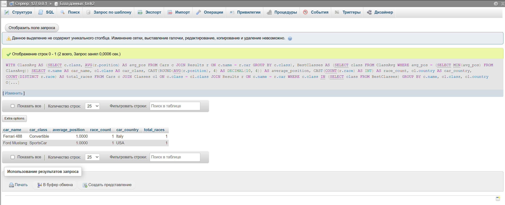

## Условие

Определить классы автомобилей, которые имеют наименьшую среднюю позицию в гонках, и вывести информацию о каждом
автомобиле из этих классов, включая его имя, среднюю позицию, количество гонок, в которых он участвовал, страну
производства класса автомобиля, а также общее количество гонок, в которых участвовали автомобили этих классов. Если
несколько классов имеют одинаковую среднюю позицию, выбрать все из них.

## Ожидаемый вывод для тестовых данных

| car_name     | car_class   | average_position | race_count | car_country | total_races |
|--------------|-------------|------------------|------------|-------------|-------------|
| Ferrari 488  | Convertible | 1.0000           | 1          | Italy       | 1           |
| Ford Mustang | SportsCar   | 1.0000           | 1          | USA         | 1           |

## Решение:

```sql
WITH ClassAvg AS (SELECT c.class,
                         AVG(r.position) AS avg_pos
                  FROM Cars c
                           JOIN Results r ON c.name = r.car
                  GROUP BY c.class),
     BestClasses AS (SELECT class
                     FROM ClassAvg
                     WHERE avg_pos = (SELECT MIN(avg_pos) FROM ClassAvg))
SELECT c.name                                            AS car_name,
       cl.class                                          AS car_class,
       CAST(ROUND(AVG(r.position), 4) AS DECIMAL(10, 4)) AS average_position,
       CAST(COUNT(r.race) AS INT)                        AS race_count,
       cl.country                                        AS car_country,
       COUNT(DISTINCT r.race)                            AS total_races
FROM Cars c
         JOIN Classes cl ON c.class = cl.class
         JOIN Results r ON c.name = r.car
WHERE c.class IN (SELECT class FROM BestClasses)
GROUP BY c.name, cl.class, cl.country
ORDER BY c.name;
```


