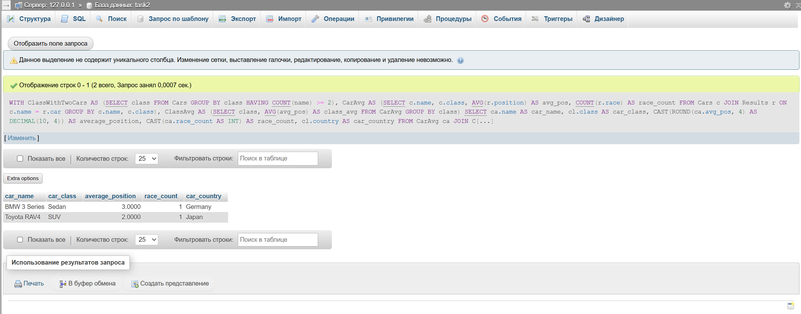

## Условие

Определить, какие автомобили имеют среднюю позицию лучше (меньше) средней позиции всех автомобилей в своем классе (то
есть автомобилей в классе должно быть минимум два, чтобы выбрать один из них). Вывести информацию об этих автомобилях,
включая их имя, класс, среднюю позицию, количество гонок, в которых они участвовали, и страну производства класса
автомобиля. Также отсортировать результаты по классу и затем по средней позиции в порядке возрастания.

## Ожидаемый вывод для тестовых данных

| car_name         | car_class | average_position | race_count | car_country |
|------------------|-----------|------------------|------------|-------------|
| BMW 3 Series     | Sedan     | 3.0000           | 1          | Germany     |
| Toyota RAV4      | SUV       | 2.0000           | 1          | Japan       |

## Решение:

```sql
WITH ClassWithTwoCars AS (SELECT class
                          FROM Cars
                          GROUP BY class
                          HAVING COUNT(name) >= 2),
     CarAvg AS (SELECT c.name,
                       c.class,
                       AVG(r.position) AS avg_pos,
                       COUNT(r.race)   AS race_count
                FROM Cars c
                         JOIN Results r ON c.name = r.car
                GROUP BY c.name, c.class),
     ClassAvg AS (SELECT class,
                         AVG(avg_pos) AS class_avg
                  FROM CarAvg
                  GROUP BY class)
SELECT ca.name                                      AS car_name,
       cl.class                                     AS car_class,
       CAST(ROUND(ca.avg_pos, 4) AS DECIMAL(10, 4)) AS average_position,
       CAST(ca.race_count AS INT)                   AS race_count,
       cl.country                                   AS car_country
FROM CarAvg ca
         JOIN ClassAvg cavg ON ca.class = cavg.class
         JOIN Classes cl ON ca.class = cl.class
WHERE ca.class IN (SELECT class FROM ClassWithTwoCars)
  AND ca.avg_pos < cavg.class_avg
ORDER BY LOWER(cl.class), ca.avg_pos;
```


