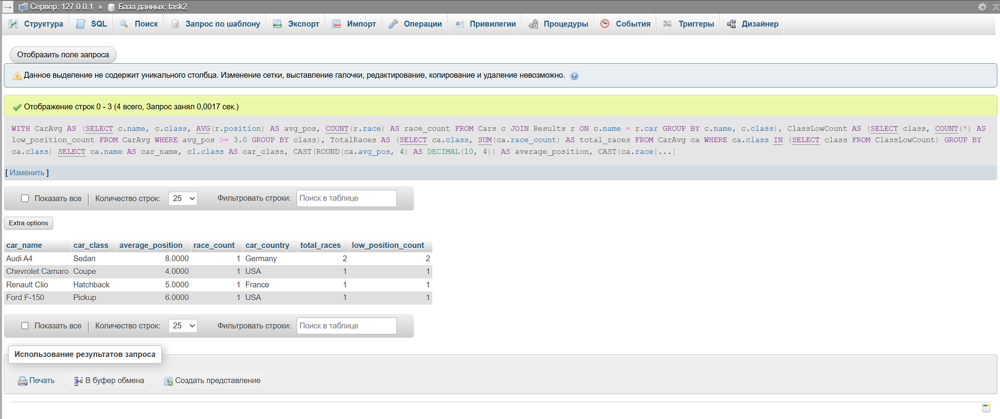

## Условие

Определить, какие классы автомобилей имеют наибольшее количество автомобилей с низкой средней позицией (больше 3.0) и
вывести информацию о каждом автомобиле из этих классов, включая его имя, класс, среднюю позицию, количество гонок, в
которых он участвовал, страну производства класса автомобиля, а также общее количество гонок для каждого класса.
Отсортировать результаты по количеству автомобилей с низкой средней позицией.

## Ожидаемый вывод для тестовых данных

| car_name         | car_class | average_position | race_count | car_country | total_races | low_position_count |
|------------------|-----------|------------------|------------|-------------|-------------|--------------------|
| Audi A4          | Sedan     | 8.0000           | 1          | Germany     | 2           | 2                  |
| Chevrolet Camaro | Coupe     | 4.0000           | 1          | USA         | 1           | 1                  |
| Renault Clio     | Hatchback | 5.0000           | 1          | France      | 1           | 1                  |
| Ford F-150       | Pickup    | 6.0000           | 1          | USA         | 1           | 1                  |

## Решение:

```sql
WITH CarAvg AS (SELECT c.name,
                       c.class,
                       AVG(r.position) AS avg_pos,
                       COUNT(r.race)   AS race_count
                FROM Cars c
                         JOIN Results r ON c.name = r.car
                GROUP BY c.name, c.class),
     ClassLowCount AS (SELECT class,
                              COUNT(*) AS low_position_count
                       FROM CarAvg
                       WHERE avg_pos >= 3.0
                       GROUP BY class),
     TotalRaces AS (SELECT ca.class,
                           SUM(ca.race_count) AS total_races
                    FROM CarAvg ca
                    WHERE ca.class IN (SELECT class FROM ClassLowCount)
                    GROUP BY ca.class)
SELECT ca.name                                      AS car_name,
       cl.class                                     AS car_class,
       CAST(ROUND(ca.avg_pos, 4) AS DECIMAL(10, 4)) AS average_position,
       CAST(ca.race_count AS INT)                   AS race_count,
       cl.country                                   AS car_country,
       tr.total_races,
       clc.low_position_count
FROM CarAvg ca
         JOIN ClassLowCount clc ON ca.class = clc.class
         JOIN TotalRaces tr ON ca.class = tr.class
         JOIN Classes cl ON ca.class = cl.class
WHERE ca.avg_pos > 3.0
ORDER BY clc.low_position_count DESC, LOWER(cl.class);
```


